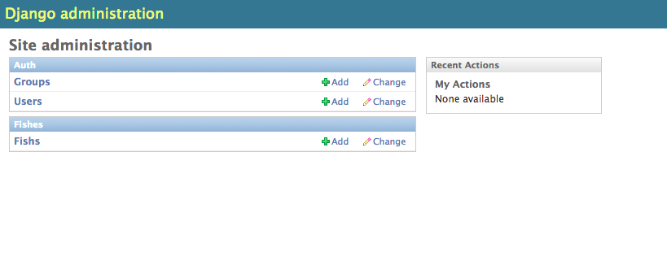
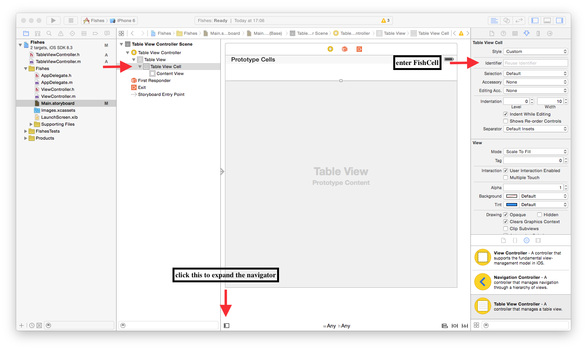
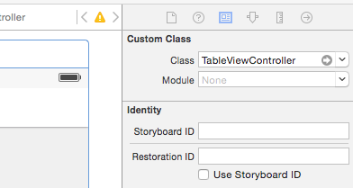

# Building simple REST API for mobile applications
## What is REST?

Representational State Transfer (REST) is lightweight HTTP based and built on web servers much like how normal web sites are build on the backend.  Instead of delivering in HTML, which is a combination of presentation and data, we would display only data with a minimum number of formatting using separators and delimiters (like JSON).  One can think of it as just an architectural style for designing networked applications or as a different way of delivering web services.  REST is also browsable so it really helps developers modify and check the correctness of their code as only the data is displayed on the browser.  It is also a safer way of providing services or data access as it does not expose too much unnecessary surface area of the database used by the website.  Some more well-known REST apis are from [Twitter](https://dev.twitter.com/rest/public)  and [Facebook Graph](https://developers.facebook.com/docs/graph-api).

REST is platform and language independent.  You could write a REST API with any language that are commonly associated with website publishing like PHP, Python or Ruby.  There are four commonly defined methods used in a REST architecture which are the create, read, update and delete methods.  I can also add other more specialized methods like getting the top ten most popular items or the highscore of all users either by writing a new method or using a query parameter like `/api/items?top=10`.

## HTTP Methods and API endpoints

You might remember from creating web forms (synchronous) or ajax request (asynchronous) calls where you have used the GET and POST requests.  The PUT and DELETE requests are very much far less used.
You’ve probably had written using PHP, Python or any other language to process form data, you have indeed written your own simple REST framework.
POST, GET, PUT, DELETE which correspond to create, read, update, delete (CRUD) also related to the most basic of database operations
API endpoints describe available operations on data exposed by the service.  Think of it as urls that provide data (GET request) or an url where you can submit data to (POST request).
There are many data formats we could use but the more common ones are JSON and XML.
GET /api/boats/123456 will return data on the boat with id 123456 even when applied multiple times.

## Using djangorestframework to build a simple REST api

I will be using Django (Python MVC) and djangorestframework.  Djangorestframework is built using django (python) specifically for exposing data via the REST framework.  I assume the reader is familiar with Django and will build a simple REST API to access data inside a database (just one table).  Here are the steps and code to create model and views.  For ease of entering data, we will input them using the existing Django admin page.

To start of, you will need to have already installed Python v2.7 or later and Django 1.7.4 or later on your system that could publish web pages.  If you have not, please install [Python](http://www.python.org/download/) and [Django](https://www.djangoproject.com/download/).

You can easily test your installation by firing up your command line, and type the `python` command, all being well you should see version information. Continue by typing:

```bash
>>> import django
>>> print(django.get_version())
1.7.4
```

This verifies that you have set up Django on your system.  Next, we build the Django project.

```bash
$ django-admin.py startproject marine
```

This is the list of files and folders created.

```bash
marine/
    manage.py
    marine/
        __init__.py
        settings.py
        urls.py
        wsgi.py
```

You can check if everything works as expected by executing:

```bash
$ python manage.py runserver
```

Which starts the Django development webserver for testing.  When successful, you will see:

```bash
Performing system checks...

0 errors found
February 15, 2015 - 15:50:53
Django version 1.7.4, using settings 'mysite.settings'
Starting development server at http://127.0.0.1:8000/
Quit the server with CONTROL-C.
```

If you open the URL http://127.0.0.1:8000/ you will see a placeholder website.

Now we have the bare skeleton of the site. Next we will build an app (a container) which houses a model (as in Model-View-Controller).  A model is the source of data for your app.  I am not going to talk too much about this but you can find more information about how to use models properly on the django website or any other MVC site.

Typing:

```
$ python manage.py startapp fishes
```

Will result in the following files

```bash
fishes/
    __init__.py
    admin.py
    migrations/
        __init__.py
    models.py
    tests.py
    views.py
```

Inside the `models.py` file, there is only the import line `from django.db import models`.  Add the following code to it.

```python
    class Fish(models.Model):
        name = models.CharField(max_length=255)
        created = models.DateTimeField('auto_now_add=True')
        active = models.BooleanField()
```
This creates a class that exposes the name, created date of the fish and if the data row is active or not.  You can change the field type by referring [to the relevant documentation](https://docs.djangoproject.com/en/1.7/ref/models/fields/#field-types).

Now add the fishes app to the `marine/settings.py` file to register it.  Under `INSTALLED_APPS`, add `fishes` to the list. Run `python manage.py sql fishes` to get a preview of the database schema SQL that will run when we activate this app.  

```sql
    BEGIN;
        CREATE TABLE "fishes_fish" (
            "id" integer NOT NULL PRIMARY KEY,
            "name" varchar(255) NOT NULL,
            "created" datetime NOT NULL,
            "active" bool NOT NULL
        )
    ;

    COMMIT;
```

To confirm creating the relevant tables on the default sqlite database, type `python manage.py migrate` or `python manage.py syncdb` on older Django versions. Django will create authentication tables by default and the empty `fishes_fish` table in a sqlite3 database.  It will ask if you want to create a superuser as this is the first time you run Django.

If for some reason you do not get prompted to create a superuser, in the command prompt, type:

```bash
$ python manage.py createsuperuser
```

Follow the instructions to create an administrator's account.  Luckily Django provides a built-in admin page that lets you quickly insert and modify data.  However, you need to activate this ability by editing the `admin.py` file inside the `fishes` folder.  Add the following code after `from django.contrib import admin`

```python
    ...
    from fishes.models import Fish
    admin.site.register(Fish)
```

You will use the account we created to log into the admin page.  Start the development server:

```bash
$ python manage.py runserver
```

Open _127.0.0.1:8000/admin_ and enter the superuser id and password.  You should see a admin page with the `Marine` list.  Click on `Fishes` to add or modify data.  Add some data to it.



Up to this point, you have built a working, but plain Django website.  I will now incorporate `djangorestframework` to the site by [downloading and installing it](http://www.django-rest-framework.org/#installation). One key thing to remember is to add `rest_framework` into the `INSTALLED_APPS` list in `marine/settings.py` and change `urls.py` to

```python
from django.contrib import admin
from rest_framework import routers
from fishes import views

router = routers.DefaultRouter()
#makes sure that the API endpoints work
router.register(r'api/fishes', views.FishViewSet)
admin.autodiscover()

urlpatterns = patterns('',
    # Examples:
    # url(r'^$', 'marine.views.home', name='home'),
    # url(r'^blog/', include('blog.urls')),

    url(r'^admin/', include(admin.site.urls)),
    url(r'^', include(router.urls)),
    url(r'^api-auth/', include('rest_framework.urls', namespace='rest_framework'))
)
```

This code switches on the API routing which is crucial to the `djangorestframework`.  If you are familiar with regular expressions, that is how I set the valid URLs of the site.

When we installed `djangorestframework`, it gave us the ability to use serializers, which flattens the data obtained from the fish model into string format, either XML or JSON.  To create a serializer for the fishes model, we create a file under the `fishes` folder and call it `serializers.py`.  Here is the contents of that file.

```python
from fishes.models import Fish
from rest_framework import serializers

class FishSerializer(serializers.HyperlinkedModelSerializer):
    class Meta:
        model = Fish
        fields = ('name', 'active', 'created')
```

In the `views.py` file, add:

```python
from rest_framework import viewsets
from rest_framework import permissions
from fishes.models import Fish
from fishes.serializers import FishSerializer

# Create your views here.
class FishViewSet(viewsets.ModelViewSet):
    # this fetches all the rows of data in the Fish table
    queryset = Fish.objects.all()
    serializer_class = FishSerializer
```

Now if you open _http://127.0.0.1:8000/api/fishes/_ you will see the browsable API.

```javascript
HTTP 200 OK
Content-Type: application/json
Vary: Accept
Allow: GET, POST, HEAD, OPTIONS

[
    {
        "name": "Dory",
        "created": "2014-06-21T04:23:01.639Z",
    },
    {
        "name": "Angel",
        "created": "2014-07-21T04:23:01.639Z",
    },
    {
        "name": "Clown",
        "created": "2014-08-21T04:23:01.639Z",
    }
]
```

Included in the article is the [REST API](https://github.com/quiksilv/simple-api-mobile/tree/master/restapi "REST API") sourcecode hosted on github.  There is no data so you would need to run `python manage.py migrate` or `python manage.py syncdb` on older Django versions.

## The iOS mobile app

I will go through the key steps required to create a mobile app that receives data from our API.  I am going to use the UITableView to display our data in a list.  In XCode 6.3.1 (the latest version as of this writing), create a new project

File > New > Project > iOS Application > Single View Application

* Product Name: Fishes
* Language: Objective-C
* Devices: iPhone (default was Universal, this includes both the iPhone and iPad)
* Not using Core Data for now.

Select a location on disk to save your project and then click Create. The `Fishes`, `FishesTests` and `Fishes.xcodeproj` files and folders will be create. I will work on the files contained in the `Fishes` folder.

By default, the project will be created with a View Controller.  I however will want to show the data from the REST API as a list, so I will use the `Table View Controller` instead.  So now I will create a new set of Objective-C files (File > New > File > iOS Source > Cocoa Touch Class).

Class: `TableViewController`
Subclass of: `UITableViewController`
we do not create a XIB file

I have just created the `TableViewController.h` and `TableViewController.m` files. These files should be created in the `Fishes` folder.

Go to the `Main.storyboard`, go to the [Object library](https://developer.apple.com/library/ios/recipes/xcode_help-IB_objects_media/Chapters/AddingObject.html "Object library") and drag the `Table View Controller` object to the storyboard.  Select and delete the default `View Controller`.  Make sure that under the [Inspector](https://developer.apple.com/library/mac/recipes/xcode_help-general/Chapters/AbouttheUtilityArea.html "Attributes Inspector"), the checkbox for `Is Initial View Controller` for the selected `Table View Controller` is ticked.



* In the `Main.storyboard`, expand the `Table View Controller` to expose `Table View Cell` then select the `Attributes Inspector` and enter `FishCell` in the `Identifier`. This links the cells in the Interface Builder's storyboard to the code.
* Also change the `Style` to `Subtitle` from `Basic`.  This provides the utility to display the value set by `cell.detailTextLabel`. 
* While selecting `Table View Controller` under the `Table View Controller Scene` as seen from the Document Outline, click on the Identity Inspector and enter `TableViewController` into Custom Class > Class. This links the entire scene to the `TableViewController.m` file.



Next, I will enter some code that will make this app do something. The code demonstrates the use of a simple `NSArray` to display data hardcoded in the `TableViewController.m`.

```objectivec
- (NSInteger)numberOfSectionsInTableView:(UITableView *)tableView {
#warning Potentially incomplete method implementation.
    // Return the number of sections.
    return 1;
}
- (NSInteger)tableView:(UITableView *)tableView numberOfRowsInSection:(NSInteger)section {
#warning Incomplete method implementation.
    // Return the number of rows in the section.  I currently have three rows we would like to show
    return 3;
}

- (UITableViewCell *)tableView:(UITableView *)tableView cellForRowAtIndexPath:(NSIndexPath *)indexPath {
    UITableViewCell *cell = [tableView dequeueReusableCellWithIdentifier:@"FishCell" forIndexPath:indexPath];
    //temporary data to demonstrate the structure of a NSDictionary in an NSArray, which is the general structure of a JSON, this can be removed in a later stage
    NSArray *fishes = @[
                        @{@"name": @"Dory", @"created": @"2014-06-21T04:23:01.639Z"},
                        @{@"name": @"Angel", @"created": @"2014-07-21T04:23:01.639Z"},
                        @{@"name": @"Clown", @"created": @"2014-08-21T04:23:01.639Z"}
                        ];
    if (cell == nil) {
        cell = [[UITableViewCell alloc] initWithStyle:UITableViewCellStyleDefault reuseIdentifier:@"FishCell"];
    }
    //I will replace fishes with fishJson once we have code that downloads from the REST api
    [cell.textLabel setText:[[fishes objectAtIndex:indexPath.row] objectForKey:@"name"] ];
    [cell.detailTextLabel setText:[[fishes objectAtIndex:indexPath.row] objectForKey:@"created"]];
    return cell;
}
```
Now, I can test my simple application.  Go to Product > Run.

Next we need a way to obtain JSON from the REST api we published using djangorestframework.  I first establish an NSArray object called `fishJson` by registering it in the @interface level and synthesizing it with `@property` and `@synthesize`.  This replaces the codes for the setters and getters.  I then replace the code we had in the `numberOfRowsInSection`, where I change `fishes` with `fishJson` which contain the JSON we downloaded from the REST API.
```objectivec
@interface TableViewController ()
@property (strong) NSArray *fishJson;
@end

@implementation TableViewController
@synthesize fishJson;
- (void) downloadData {
    //I use NSMutableString so we could append or replace parts of the URI with query parameters in the future
    NSMutableString *remoteUrl = [NSMutableString stringWithFormat:@"http://127.0.0.1:8000/api/fishes/?format=%@", @"json"];
    NSURLRequest *request = [NSURLRequest requestWithURL:[NSURL URLWithString:remoteUrl] ];
    NSError *jsonError = nil;
    NSHTTPURLResponse *jsonResponse = nil;

    NSData *response;
    do {
        response = [NSURLConnection sendSynchronousRequest:request returningResponse:&jsonResponse error:&jsonError];
    } while ([jsonError domain] == NSURLErrorDomain);

    if([jsonResponse statusCode] != 200) {
        NSLog(@"%ld", (long)[jsonResponse statusCode]);
    } else {
        NSLog(@"%@", @"200 OK");
    }
    NSError* error;
    if(response) {
        //fishJson was defined earlier near the top as a NSArray object
        fishJson = [NSJSONSerialization
                JSONObjectWithData:response
                options:kNilOptions
                error:&error];
    }
}
```
Also, we update the method `numberOfRowsInSection`.  The code makes sure that the number of rows matches the number of elements as contained in the `fishJson` array.
```objectivec
- (NSInteger)tableView:(UITableView *)tableView numberOfRowsInSection:(NSInteger)section {
#warning Incomplete method implementation.
    // Return the number of rows in the section.
    return [fishJson count];
}
```
Now you have a working simple mobile app to display data obtained from an online or local REST API.  To run the mobile app on the iOS simulator, go to Product then Run.  If you have problems getting the iOS code error free, you can download it [here](https://github.com/quiksilv/simple-api-mobile/tree/master/iphoneapp "iPhone code").
