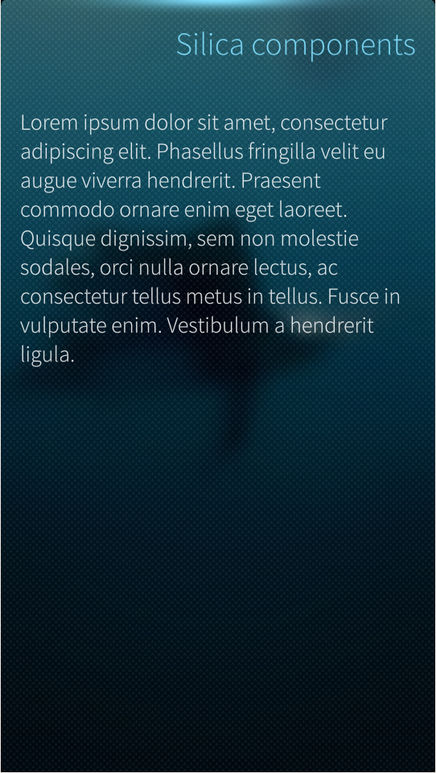
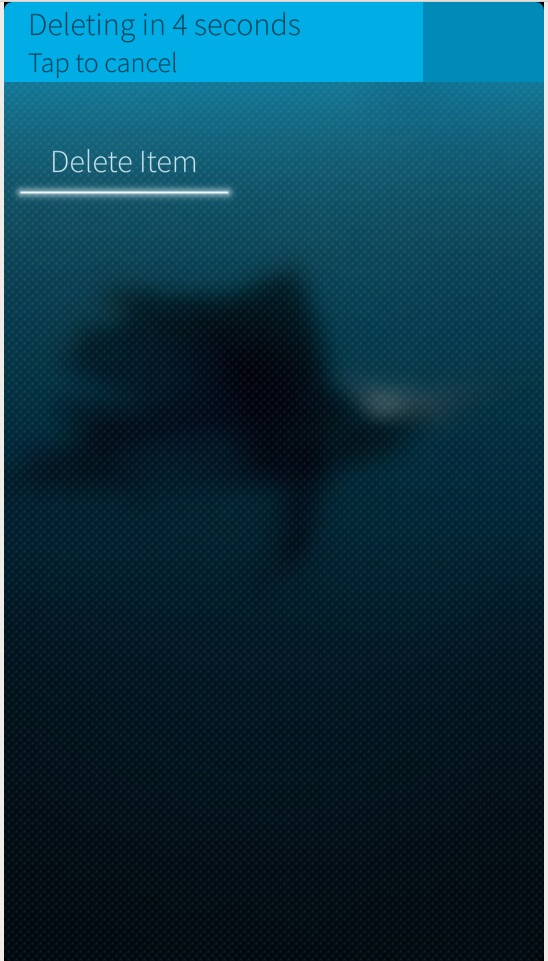
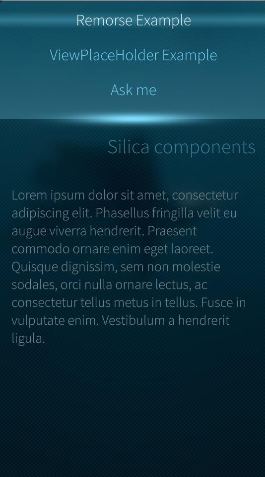
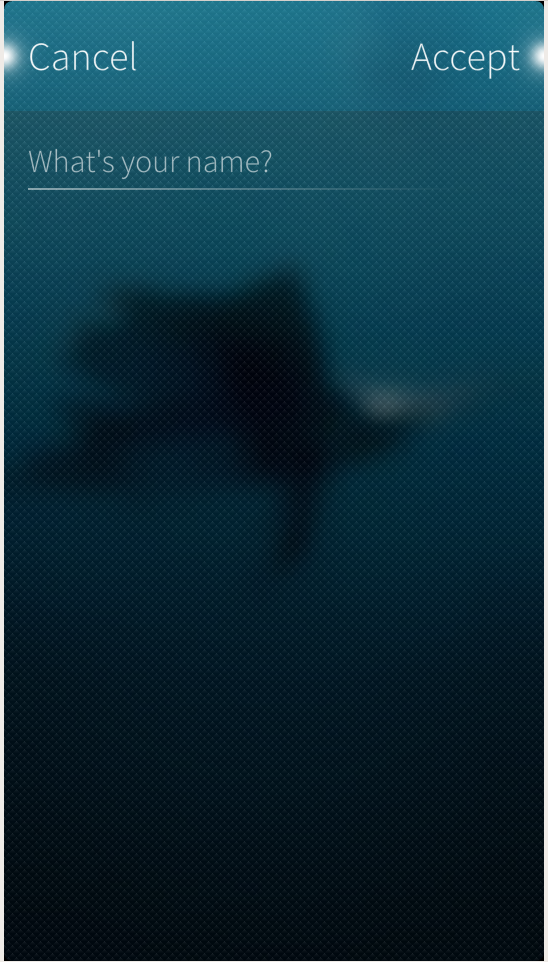

## Silica Components
	
### Introduction
Sailfish UI is written using the QML declarative language, that allows user interfaces to be described in terms of their visual components and how they interact and relate with the others.


It has a JSON-like syntax with support for Javascript expressions and dynamic property bindings. One of its key features it's its highly readable and it allows components to be easily reused and customized within a user interface.


With QML creating highly performant, fluidly animated and visually appealing applications it's easy and the QtQuick module provide the basic components to build any kind of UI.


The Sailfish SDK includes Sailfish Silica, an extension QML module, providing additional types specifically designed for use by Sailfish applications.


When writing Sailfish applications with QML, you will need to make use of both the Sailfish Silica and QtQuick modules.
You should use Silica whenever possible, as this components have a Sailfish look and feel, behave consistently with standard Sailfish applications and enable apps to make use of unique Sailfish features, such as pulley menus and application covers.


In this article I will describe the most relevant and peculiar components and I'll show how to use it and when.

### Basic Components
QTQuick provides the basic object type an app will need, such as Image, Rectangle, Circle, Item, and ListView. A Complete list can be found here [http://doc.qt.io/qt-5/qtquick-qmlmodule.html](http://doc.qt.io/qt-5/qtquick-qmlmodule.html).


Those type can be used in Sailfish application, but you should use the right Silica components when avoidable (SilicaListView vs ListView, SilicaGridView vs GridView etc. ) as they are customized to have the Sailfish look and feel.


To use these components just


```javascript

import QtQuick 2.0

```


in the QML file and this:

```javascript
import Sailfish.Silica 1.0

```

to start using the Silica components.

### Theme
Now let's start to talk about the Silica components. The Theme object provides common style information like colors, fonts and margins.
Colors will match the ambiance selected by the user. 


Let's start with an example:


```javascript
Text {
    color: Theme.primaryColor
    font.family: Theme.fontFamily
    font.pixelSize: Theme.fontSizeMedium
}

```


A Text element is a read-only formatted text view. Here I defined the three most common property for a text, using the relative Theme's property.
The Theme object define a set of property for sizes, colors, and fonts:


Two standard fonts are used in the Sailfish UI:

* Theme.fontFamily - the default font, used for label, button etc
* Theme.fontFamilyHeading - used to display heading text, as titles, pages header etc.


The font pixel size is defined in this properties:


* Theme.fontSizeExtraSmall
* Theme.fontSizeSmall
* Theme.fontSizeMedium
* Theme.fontSizeLarge
* Theme.fontSizeExtraLarge


And the color values:


* Theme.primaryColor - used for Labels
* Theme.secondaryColor - used for the less prominent parts of the UI
* Theme.highlightColor - used for active and selected areas of the UI
* Theme.secondaryHighlightColor - a less prominent highlight color


In the Silica modules a Label components it's available, and it should be used in preference to the Text element as it made use of the above settings.


Finally the the Theme object exposes all the standard item size and padding values:


* itemSizeSmall - small item size, for example used in one-line list items
* itemSizeMedium - medium item size, for example used in two-line list items
* itemSizeLarge - large item size used in complex list items, also used in items with some content to preview
* itemSizeExtraLarge - extra large item size, one fourth of the portrait width, used in list header grids
* paddingSmall - small padding, commonly used between labels close together
* paddingMedium - medium padding, common margin within UI components
* paddingLarge - large padding, commonly used as page margin close to the display borders


Use those wherever possible, so the application will look coherent to the platform look&feel.


### Page and PageStack
A _Page_ defines an individual screen of content to which the user may navigate from within the app.
It is usually sized to the full width and height of the screen for the current orientation, but it may be resized due to orientation changes or the input panel being displayed.


To ensure that the content can be scrolled if the page is to small, put everything in a SilicaFlickable.


If you need to display a page title use the _PageHeader_ type, that's is specifically made for this.


Here an example:





```javascript
import QtQuick 2.0
import Sailfish.Silica 1.0

Page {
    SilicaFlickable {
        contentHeight: column.height
        anchors.fill: parent

        VerticalScrollDecorator {}

	    Column {
            spacing: Theme.paddingLarge
            id: column
            width: parent.width

            PageHeader {
                title: "Silica components"
                id: header

            }

            Label {
                text: "Lorem ipsum dolor sit amet, consectetur adipiscing elit. Phasellus fringilla velit eu augue viverra hendrerit. Praesent commodo ornare enim eget laoreet. Quisque dignissim, sem non molestie sodales, orci nulla ornare lectus, ac consectetur tellus metus in tellus. Fusce in vulputate enim. Vestibulum a hendrerit ligula."
                font.pixelSize: Theme.fontSizeSmall
                wrapMode: Text.Wrap

                anchors {
                            left: parent.left
                            right: parent.right
                            margins: Theme.paddingLarge
                        }
            }
   
    	}
    }
}

```


I defined a Page that contains just one child, a SilicaFlickable to ensure that if the content will be too long to fit it will be scrollable.
So added a VerticalScrollDecorator to give a visual feedback to the user while scrolling.


Then a Column, a QtQuick components that can be used to vertically position a series of items without using anchors.
I also used the Theme object to set the spacing property.


I used the PageHeader type to display the page title and finally I created a Label, with some text and the needed property to display it as I wish.


Pages are handled with a stack-based navigation model provided by the PageStack type.
Our ApplicationWindow (the top-level component of a Sailfish application) has a property called _pageStack_ that hold an instance of this, always displaying the top-most page in its page stack.


A page may be pushed (_push()_ method) onto the stack to place it at the top of the stack, or popped (_pop()_) to remove it.


With this model it's simple to provide hierarchical navigation within an application where gestures and standard buttons allow the user to easily navigate back and forth 


As visible in this image the indicators in top-left (or top-right) margins of a page stack indicate whether the page can be swiped back or forward.
Navigation gestures can also be invoked pragmatically, via the _navigateBack()_ and _navigateForward()_ functions.


As an example if I add this code as a child of the Column object:


```javascript

        Button {
            text: "next page"
            onClicked: pageStack.push("MyPage.qml")
		}
			
        Button {
			text: "previous page"
		    onClicked: pageStack.pop()

        }

```


where MyPage.qml is the name of the page itself, user can navigate thought more instance of the same page, back and forward.


### Cover


Active covers is one of the distinctive elements of Sailfish, it's the visual representation of an application running in background and it will be visible on the Home screen.


It can be used to display real time information to the user (like the currently playing song) and to provide one or two cover action that can be triggered directly without the need to open the applicant (eg. Pause, skip song).


The _ApplicationWindow_ hold the instance of the Cover, that can be created using as a top-level element the _CoverBackground_ type:


```javascript

import QtQuick 2.0
import Sailfish.Silica 1.0

CoverBackground {

    Image {
        id:background
        fillMode: Image.PreserveAspectCrop
        source: "landscape.png"
    }

    Label {
        anchors.centerIn: parent
        id: label
        width: parent.width
        horizontalAlignment: Text.AlignHCenter
        text: "Hello cover"
    }


    CoverActionList {
        id: coverAction

        CoverAction {
            iconSource: "image://theme/icon-cover-new"
            onTriggered: addItem()
        }

    }

    function addItem() {
        console.log("Adding item")
    }

}

```

In this sample I just created a CoverBackgrond object, added as its child an Image, that will be used as a background and it will fill the entire cover,  preserving the image aspect ratio.


Then I added a centered label and finally a CoverActionList with one CoverAction.


CoverAction specifies the action to take when a cover gesture is activated. It's defined with an icon and a function to be triggered at the right time. Sailfish will handle only two CoverAction for a cover.
In the code you can also see how javascipt-like function and sintax can be used in QML, declaring function and using it as a callback for events.


###  RemorsePopup and RemorseItem
Another really interesting element present in the Sailfish UI toolkit is, in my opinion, the RemorsePopup.


This type that allows destructive options to be performed after a remorse period has elapsed.
Users change their mind, or simply hit the wrong button, so providing them an option to cancel a destructive action is always good, especially on touch devices.





The user can tap the RemorsePopup before the timeout, and cancel the destructive action.


Adding a RemorsePopup is easy. If I have a "delete" Button:


```javascript

Button {
   text: "Delete Item"
   onClicked: deleteItem()
}

```


Leaving untouched the deleteItem method, I can just change the code like this:


```javascript
Button {
   id: button
   text: "Delete Item"
   onClicked: remorse.execute("Deleting",  deleteItem )
   RemorsePopup { id: remorse }

}


```


When user click the button the RemorsePopup will be displayed with the specified text.


Once the timeout has expired the deleteItem will be called, else if the user click on the RemorsePopup. 


The RemorseItem type works exactly in the same way, but can be attached to an object ( like a list element ) and it will become a sibling to its target parent.


### Pulley Menu

In Sailfish menu are usually represented as a Pulley menu. It is positioned above/under the content of the view and is accessed by dragging the view down/up. The menu items are activated by either:

* dragging the view down/up to highlight a menu item and releasing to activate
* dragging or flicking to expose the entire menu, and tapping a menu item to activate


Pulley menu should be added to a SilicaFlickable, SilicaListView, SilicaGridView or SilicaWebView to work.


The PullDownMenu is the type used to create a pulley menu, and it will be populated by declaring MenuItem objects as its children.





```javascript
import QtQuick 2.0
import Sailfish.Silica 1.0

Page {
        SilicaListView {
            PullDownMenu {
                MenuItem {
                    text: "Option 1"
                    onClicked: console.log("Clicked option 1")
                }
                MenuItem {
                    text: "Option 2"
                    onClicked: console.log("Clicked option 2")
                }
            }
            header: PageHeader { title: "Header" }
            delegate: MyListItem {}
            model: MyModel {}
        }
    }


```


### ViewPlaceholder

Another handy components it's the ViewPlaceholder. It provide a placeholder text to be displayed in empty views when no content is available.


In this way the user will be aware that the app is ready but there is nothing to show.


If the view has a PullDownMenu, tapping on the ViewPlaceholder will show the menu to indicate to the user that options may be available there.


```javascript
Page {
    SilicaListView {
        id: view
        anchors.fill: parent
        model: ListModel { }

        ViewPlaceholder {
            enabled: view.count == 0
            text: "Nothing to show now"
        }

        delegate: BackgroundItem {
            width: view.width
            Label { text: "Item " + index }
        }
    }
}
	
```
	
In this example I added a ViewPlaceholder to a SilicaListView and binded its enabled property to the count property of list itself.


As soon as we add something to the list model our ViewPlaceholder will disappear.

### Dialog

_Dialog_  is a generic container for displaying a dialog that accepts user input. It will show as a modal dialog box added to the top of a PageStack.
The user can accept a dialog ( confirming modifications or input and proceed ) pushing the page from right to left, or tapping the Accept Button. Conversely, dialog is reject by pushing the page from left to right, or tapping the Cancel Button.


A simple dialog can be created in this way:





```javascript
import QtQuick 2.0
import Sailfish.Silica 1.0

Dialog {
    property string name

    Column {
        width: parent.width

        DialogHeader { }
        TextField {
            id: nameField
            width: 480
            placeholderText: "What's your name?"
        }
    }

    onDone: {
        if (result == DialogResult.Accepted) {
            name = nameField.text
        }
    }
}

```


The onDone event will be triggered when the user accept or dismiss the dialog. The DialogResult.Accepted hold the user intention.


DialogHeader should be used to provide page indicators at the top of the dialog page.


The Dialog can be displayed pushing it to the pageStack as a normal Page.

```javascript
Column {
    Label {
        id: displayedName
    }

    Button {
        text: "Ask me"
        onClicked: {
            var dialog = pageStack.push("NameInputDialog.qml", {"name": displayedName.text})
            dialog.accepted.connect(function() {
                displayedName.text = "My name: " + dialog.name
            })
        }
    }
}

```

Above, I connected the signal "accepted" of the dialog to a js function that updated the label, using the name property of the Dialog (set when the dialog is accepted). 


If the dialog is rejected, the onRejected signal handler is called and result is set to DialogResult.Rejected.


### Conclusion


This is a brief introduction to the most peculiar Silica components, that it's important to understand and use correctly to create a native application with the Sailfish look and feel.


There are even some smaller but handy component that worth the developer attention, like the _BackgroundItem_, _BusyIndicator_, _Drawer_, _Switch_.


You can find them all well documented in the SDK Documentation and they will easy to use.


_SilicaListView_, _SilicaGridView_ and others require a little bit more effort to be understood, and I'm going to write a proper article for them.


Meanwhile, play with these components and enjoy Sailfish.
