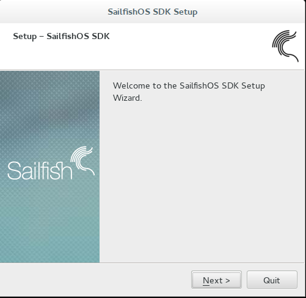
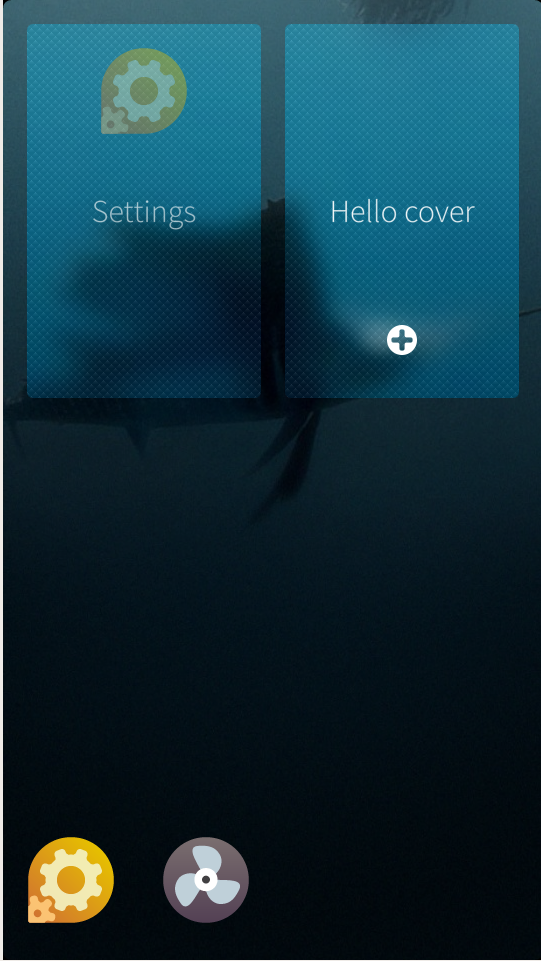
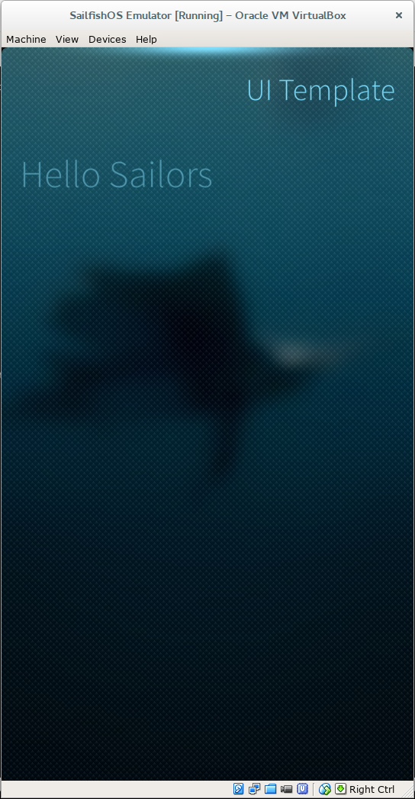

## Hello Sailfish
### Intro
After Jolla won the last Mobile World Congress best tablet awards, the interest in their operating system called SailfishOS has grown up faster and faster.


Sailfish is a modern and secure operating system build on top of the Mer open source project, so it's like a classic Linux distribution with the great addition of the Jolla crafted Sailfish UI.
There's no button on Sailfish devices, everything it's handled with simple gestures, supported by an appealing design style.


It's a really interesting platform, for both users and developers.
In this article I'll show how easy and clever it's to develop on this new and promising platform.

### Developer environment set up
The SDK it's based on the QT Creator development environment, and a series of tools useful to build and test applications.


It contains the Mer build engine for cross compilation, an Emulator and all the API documentation. Sailfish SDK is supported on Linux, OS X and Windows, so you have no excuse to not give it a try.
You need to install [VirtualBox](http://www.virtualbox.org/) and then download the SDK for your platform avaialable [here](https://sailfishos.org/develop/).
You can find detailed install instructions for each platform [here](https://sailfishos.org/develop/sdk-overview/develop-installation-article/), but everything should be smooth as double click on the installer file and click "Next" a couple of times.



The installation comes with everything pre-configured, so launch the Sailfish IDE and we are ready to start.


### Creating a project
After Qt creator has finished loading click on _File→New File_ or Project and select _Applications→SailfishOS_ Qt Quick Application.


Now fill in your project name and choose the directory where it will be saved. If you plan to submit the application to the Jolla Harbour (this is the name of the Jolla developer portal), you should use a name like "harbour-myApplicationName". This will become the package name when the app is ready to ship.


Click next and select both "MerSDK-SailfishOS-armv7hl" and "MerSDK-SailfishOS-i486". The first is to build for the Jolla Phone, the second for the emulator.


Go on clicking next, fill in the project summary and description.





Finally click next and choose if you want to add the project under git for version control.
The project is now ready. The entry point of the app will be the _"src/yourappname.cpp"_:


### Coding time


It's time to look at the example project that the SDK had created for us. Open the file _"src/yourappname.cpp"_


```javascript
int main(int argc, char *argv[])
	{
		return SailfishApp::main(argc, argv);
	}

```


This is the only strictly necessary c++ code you have to include in the application. This will create a QGuiApplication and a QQuickView instances and loads the main QML file, named as your target name.
Sailfish UI use the QML language, that is a JavaScript-based, declarative language for designing user interface–centric applications. It is part of the QT Framework.
Have a look now at the QML file named _qml/yourappname.qml_:


```javascript

import QtQuick 2.0
import Sailfish.Silica 1.0
import "pages"
```


The first two lines will import Qt Quick And Sailfish Silica modules, in this way we can use the basic "widgets" (this is not the proper name in the QML context) provided by the Os.


The last import loads all the QML file in the pages sub directory, and they will be made available in the current QML file.


```javascript
ApplicationWindow
{
    initialPage: Component { FirstPage { } }
    cover: Qt.resolvedUrl("cover/CoverPage.qml")
}
```


The ApplicationWindow is the top-level element of all Sailfish Silica app. It set up the initial page to show when the app starts and also define the Cover to be displayed when app is pushed in the background.


QML Objects are specified by their type, followed by a pair of braces. Object types always begin with a capital letter. A list of the basic QML Elements can be found [here](http://qt.apidoc.info/4.8.5/qmlbasicelements.html) and the Sailfish specific element, called Silica components, is listed in the SDK documentation (_Help→Contents→Sailfish Silica Reference Documentation_)


The _qml/pages/FirstPage.qml_ file contains a single Page to be displayed:


```javascript
Page {
    id: page
```


The Page object is a simple container. It's possible to define the id property with a name of our choice, and use it every time it's needed to refer to the specific object.
It can be defined for all the QML objects.


```javascript
    SilicaFlickable {
        anchors.fill: parent
```
		


The first child of the Page element it's a SilicaFlickable. This is an element that places its children on a surface that can be dragged and flicked. You can use [anchors](http://doc.qt.io/qt-5/qtquick-positioning-anchors.html) to align and placing element in relation of each other.


The flickable is needed here in order to use the next element, a pulley menu, that's is one of the key element in the Sailfish UI. 
A pulley menu is an extension of a page, it can be placed at the top or bottom and it revealed when user moves the content, freeing the user from the need to reach the top or the bottom of the screen to select a menu item.


Adding a pulley menu it's straightforward:


```javascript
        PullDownMenu {
            MenuItem {
                text: qsTr("Show Page 2")
                onClicked: pageStack.push(Qt.resolvedUrl("SecondPage.qml"))
            }
        }
```


A pulley menu always needs to be a child of a flickable element ( SilicaFlickable, SilicaListView, or SilicaGridView ). Defining multiple MenuItem it's possible but guidelines suggest to do not exceed five elements.


In the code above an action it's attached to the onClicked event, using the pageStack object to push _SecondPage.qml_ to the view.


```javascript
	Column {
            id: column

            width: page.width
            spacing: Theme.paddingLarge
            PageHeader {
                title: "UI Template"
            }
            Label { 
                x: Theme.paddingLarge
                text: "Hello Sailors"
                color: Theme.secondaryHighlightColor
                font.pixelSize: Theme.fontSizeExtraLarge
            }
		}
```


The Column element positions its child vertically making them not overlapping. 
The PageHeader elements define the title displayed on the top of the content and the Label, well it's just a label.


Notice how spacing, font size and color are defined using the Theme object. In this way it's not needed to hardcode nothing, and I will be sure that my app will scale good on different device, and text will be easy to read on any ambiance users will choose. The Ambiance is a sort of "theme" in Sailfish but it also change the looks of every application, making those to match the colors/backgrounds etc. of the selected one.


Now open the _qml/cover/CoverPage.qml_ file. 


```javascript
CoverBackground {
    Label {
        id: label
        anchors.centerIn: parent
        text: "My Cover"
    }
 
    CoverActionList {
        id: coverAction
        
        CoverAction {
            iconSource: "image://theme/icon-cover-next"
        }
        
        CoverAction {
            iconSource: "image://theme/icon-cover-pause"
        }
}
```

Covers in Sailfish is the visual representations of background application and they are displayed on the running applications screen ( think about the Android task switcher).


In this example the Cover display a Label and provide two coverAction that allow user to interact with our application, even if it will be in background.


The onTriggered event is fired whenever a cover action is activated but is not used in this example.


### Run the app


Click now on the Sailfish logo on the left sidebar, and choose the _"MerSDK-SailfishOS-i486"_ kit to choose to build and run the application on the emulator.


Press the green _play_ button to compile and run the project. The first time you'll be asked to start the Mer build machine and the emulator, click "Yes" and wait the emulator to pop ups and your app to starts.





The "Application Output" tab will display all the logs from the app errors and  "console.log" messages.


### Summing Up


Now you have the tools and the knowledge needed to write a basic but pleasantly looking Sailfish application. 


I found Sailfish SDK more clever than the most of other mobile SDKs and even the emulator runs really smooth, making the development on this platform a real joy.
I will discuss more about Silica UI components and their parallels with other mobile OS in some feature article.


Happy hacking.
